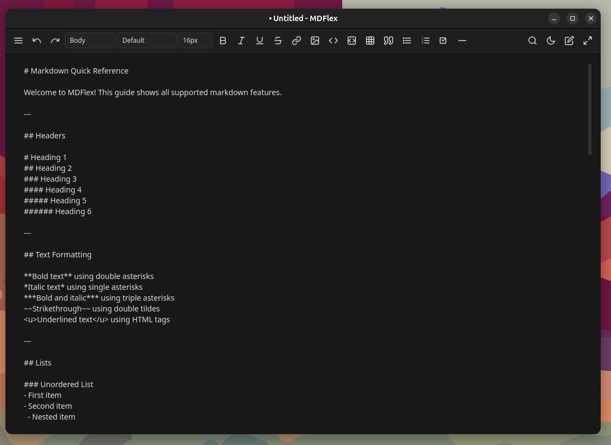
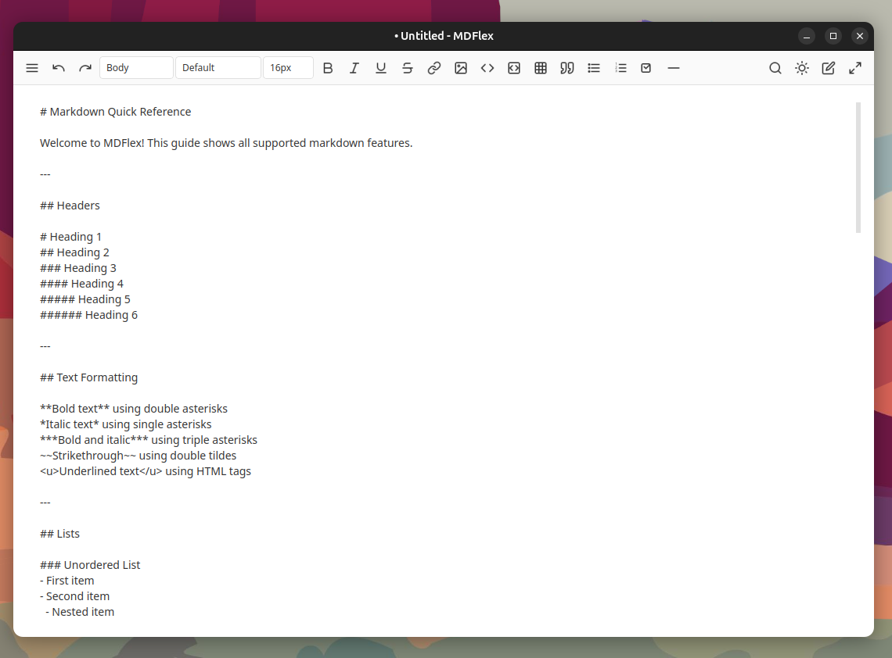
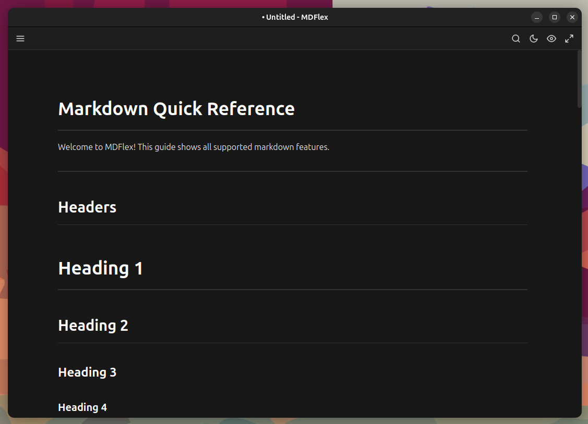
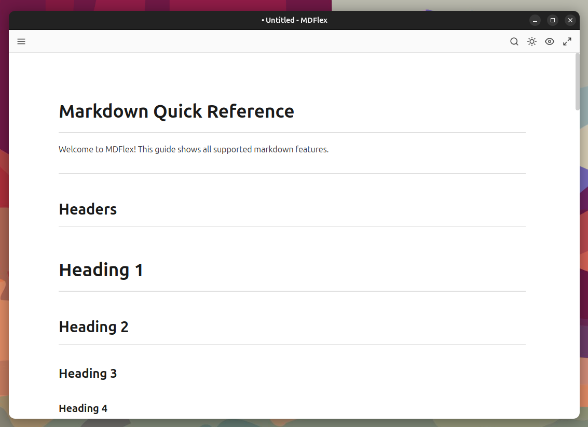

# MDFlex

A simplistic, modern markdown reader and editor built with Python, PyQt6 and Claude credits.

**Author: Redz** | **Email: redzdev@pm.me**

## Quick Install (Ubuntu/Debian)

Download the latest `.deb` from [Releases](https://github.com/NoPeRedz/MDFlex/releases) and install:

```bash
sudo apt install ./mdflex_1.0.0-1_all.deb
```

Or build from source (see below).

---

## Why MDFlex?

If you've ever worked with AI coding agents, you know the struggle - they constantly generate markdown documentation, README files, and formatted text. But the built-in code editor viewers just don't cut it for properly viewing and editing markdown. You end up switching between raw text and trying to imagine how it renders.

**MDFlex solves this problem.** It gives you a proper, dedicated markdown editor with live preview, so you can actually see what your markdown looks like as you write or review it. No more guessing, no more context switching - just clean, real-time markdown editing.

## Screenshots

### Editor Mode (Dark Theme)


### Editor Mode (Light Theme)


### Reader Mode (Dark Theme)


### Reader Mode (Light Theme)


---

## Features

- **Live Preview**: See your markdown rendered in real-time as you type
- **Dark/Light Theme**: Toggle between a comfortable dark gray theme and a clean light theme
- **Read/Write Mode**: Switch between editing mode (split view) and reading mode (preview only)
- **Modern Toolbar**: Docs inspired interface with all formatting tools at your fingertips
- **Full Markdown Support**: Headers, bold, italic, strikethrough, code blocks, tables, lists, and more
- **Export to HTML**: Save your documents as standalone HTML files
- **Word & Character Count**: Track your document statistics in the status bar
- **Zoom Control**: Adjust editor zoom from 50% to 200%

## Installation

### From Source (Development)

1. Clone the repository:
```bash
git clone https://github.com/NoPeRedz/MDFlex.git
cd MDFlex
```

2. Create a virtual environment (recommended):
```bash
python3 -m venv venv
source venv/bin/activate
```

3. Install dependencies:
```bash
pip install -r requirements.txt
```

4. Install required system library (Ubuntu/Debian):
```bash
sudo apt install libxcb-cursor0
```

5. Run the application:
```bash
python -m mdflex_app.main
# or
python run.py
```

### Building Ubuntu .deb Package

1. Install build dependencies:
```bash
sudo apt install dpkg-dev debhelper dh-python python3-all python3-setuptools libxcb-cursor0
```

2. Build the package:
```bash
chmod +x build-deb.sh
./build-deb.sh
```

3. Install the package:
```bash
sudo apt install ./releases/mdflex_1.0.0-1_all.deb
```

4. Uninstall (if needed):
```bash
sudo apt remove mdflex
```

## Usage

### Keyboard Shortcuts

| Shortcut | Action |
|----------|--------|
| Ctrl+N | New file |
| Ctrl+O | Open file |
| Ctrl+S | Save file |
| Ctrl+Shift+S | Save as |
| Ctrl+B | Bold |
| Ctrl+I | Italic |
| Ctrl+E | Toggle Read/Write mode |
| Ctrl+T | Toggle Dark/Light theme |
| Ctrl++ | Zoom in |
| Ctrl+- | Zoom out |
| Ctrl+Z | Undo |
| Ctrl+Y | Redo |

### Toolbar

The toolbar provides quick access to:
- **Undo/Redo** - Navigate your edit history
- **Zoom** - Adjust view from 50% to 200%
- **Style** - Quick paragraph/heading selection (Body, H1-H6)
- **Font & Size** - Typography controls
- **Formatting** - Bold, Italic, Underline, Strikethrough
- **Insert** - Links, Images, Tables, Code blocks, Quotes
- **Lists** - Bullet, Numbered, Task lists
- **Mode toggle** (✏️ Edit / 👁️ Read)
- **Theme toggle** (🌙 Dark / ☀️ Light)
- **Fullscreen** - Distraction-free editing

## Requirements

- Python 3.9+
- PyQt6 >= 6.4.0
- PyQt6-WebEngine >= 6.4.0
- markdown >= 3.4.0
- Pygments >= 2.14.0
- libxcb-cursor0 (system library)

## License

MIT License - see [LICENSE](LICENSE) for details.

## Author

**Redz**  
Email: redzdev@pm.me
